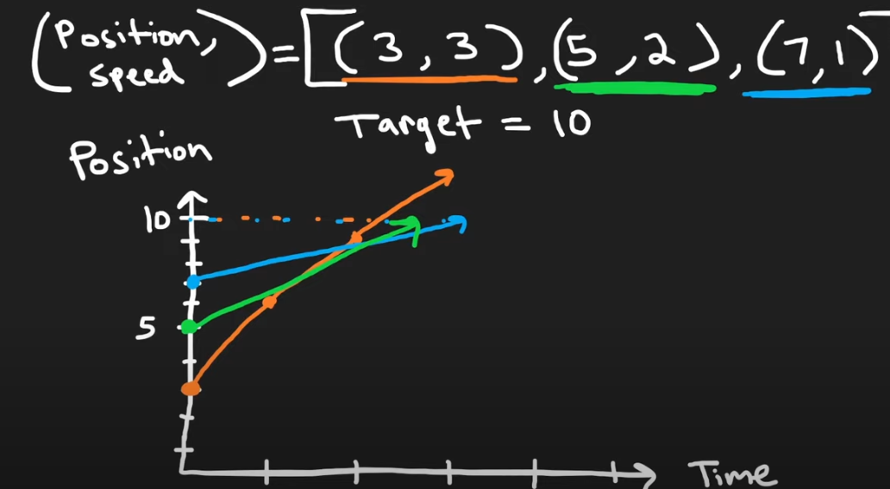

# Though Process

## Understanding the Problem

- we need to determine the number of car fleets that will arrive at the target
- a car fleet is a group of cars that travel together at the same speed
  - if a car catches up to another car, it becomes a car fleet
  - a car fleet can have one or more cars

## Observations

- cars that start closer to the target can potentially form fleets with cars behind them
- sorting the cars by their starting positions will help in processing them

## Approach

- we can create an array of pairs from the given input arrays, <position, speed>[]
  - sort the array of pairs by the position, in decreasing order, so that the cars closest to the target are at the beginning
- we can iterate through the array of pairs
  - for each pair, we can calculate the time it will take to reach the target
    - this can be calculated by dividing the distance (required to reach the target) by the speed
  - if the time it takes to reach the target is greater than the time it takes for the car behind it to reach the target
    - we can increment the number of car fleets
    - update the time it takes for the car behind it to reach the target

- in the graph, [NeetCode](https://www.youtube.com/watch?v=Pr6T-3yB9RM) sorts the pairs by the position in increasing order but iterates through them in reverse order.
